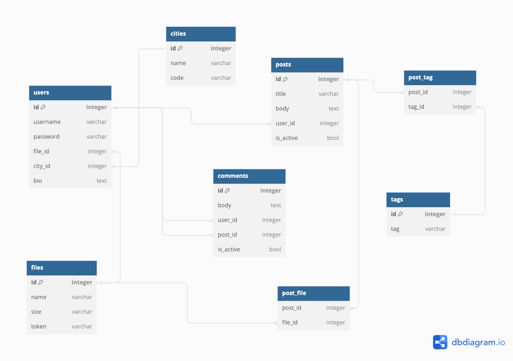

### PostgresSQL
* анкеты людей (имя, описание, фото, город);
* посты (описание, медиа, хэштеги,комментарии);



### Minio
(фото, аудио, видео)
```
buckets: {
  posts
  users
}
```


###MongoDB
Лайки и просмотры постов

```json

{
  "posts": {
    "_id": 123,
    "likes": 0,
    "views": 0
  }
}
```
Личные сообщения и чаты (только текст и прочитанность сообщений)
```json

{
  "messages": {
    "_id": 123,
    "user_id": 1,
    "text": "hello",
    "is_read": true
  }
}
```

### Neo4j
* интересы
* друзья 
* подписчики
* любовные отношения

```json
{
  "user": {
    "id": 1,
    "friends": [
      1,
      2
    ],
    "followers": [
      1,
      2
    ],
    "loves": {
      "type": "married",
      "user_id": 2
    },
    "interests": []
  }
}
```

```json
{
  "interests": {
    "id": 1,
    "type": "music",
    "name": "musical instruments"
  }
}
```
